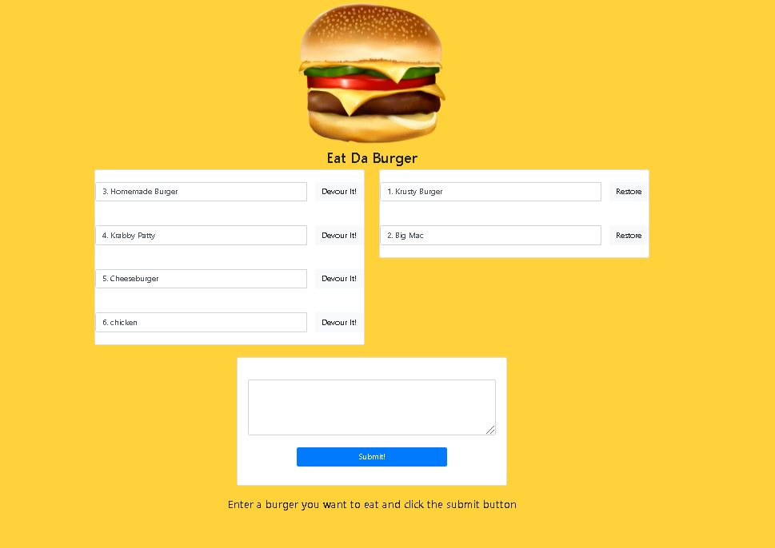

### Eat Da Burger
#

## This is a simple Burger Generator application. Where you enter the name of a Burger you want to eat click on Submit. Than you either click on Devour, or Restore. Click on the below Image which is also a link to be brought to the application which is deployed on Heroku.
##
<a href="https://polar-hollows-18989.herokuapp.com/">

## This application uses Routes, SQL, A Custom ORM, Handlebars as well as Heroku

# Built with
![alt_text] (https://img.shields.io/badge/Technologies-ORM-green)
#
![alt_text] (https://img.shields.io/badge/Technologies-Handlebars-green)
#
![alt_text] (https://img.shields.io/badge/Technologies-SQL-green)
#
![alt_text] (https://img.shields.io/badge/Technologies-SQL-green)
#
![alt_text] (https://img.shields.io/badge/Technologies-nodeJS-green)
